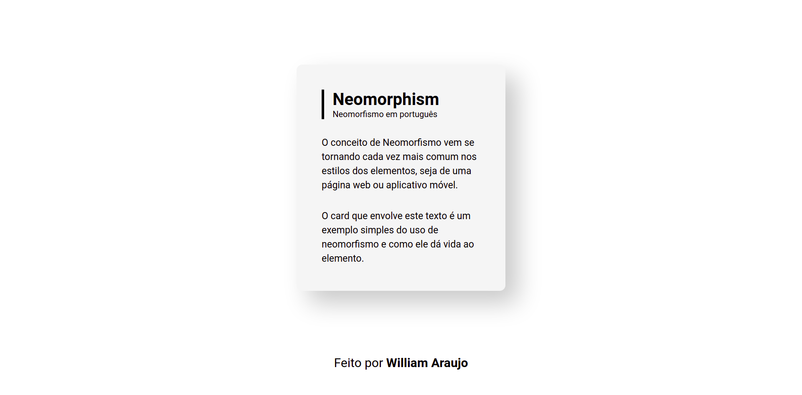

# Neomorfismo

### Exemplo básico de um elemento em tela com estilo baseado no neomorfismo. Sombras sobrepostas e impressão de alto relevo dão vida e foco onde esse conceito é aplicado.

Para acessar um gerador de base neomorfismo, clique [aqui](https://neumorphism.io/#e0e0e0)

Abaixo segue um screenshot da tela criada:
